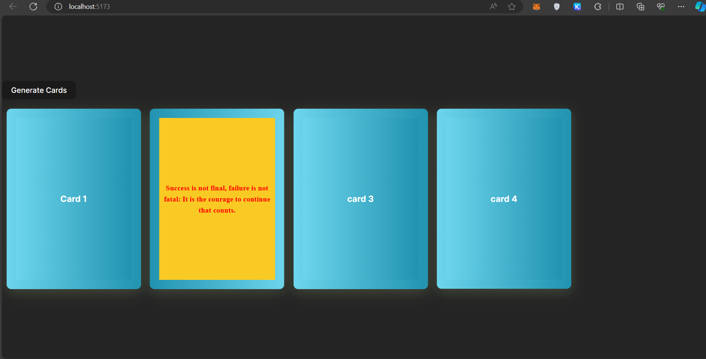

# React + Vite

This template provides a minimal setup to get React working in Vite with HMR and some ESLint rules.

Currently, two official plugins are available:

- [@vitejs/plugin-react](https://github.com/vitejs/vite-plugin-react/blob/main/packages/plugin-react/README.md) uses [Babel](https://babeljs.io/) for Fast Refresh
- [@vitejs/plugin-react-swc](https://github.com/vitejs/vite-plugin-react-swc) uses [SWC](https://swc.rs/) for Fast Refresh

This is a simple card flipper app designed using react. 
## Installation and using this repo
Step 1:  Clone this repo using `git clone https://github.com/Rahul1227/Card_flipper.git` 
Step 2: Move to CardGenerator folder using `cd CardGenerator` 
Step 3: Instal react using `npm install` 
Step 4: Run using `npm run dev`

#Demo

